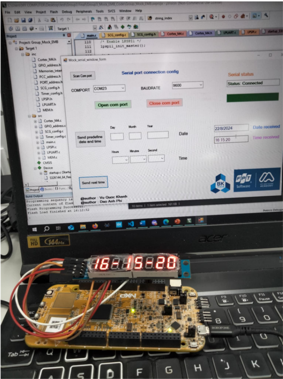

# The Digital Clock Design Using NXP Microcontroller, 7 Segment LED, Setting Time And Alarm Through GUI App

## Project Overview
- Design a Digital Clock with NXP S32K144 MCU 
- Design a C# GUI to modify the time of this digital clock
- For architecture and detail design of the clock : [text](Document_and_unit_test/Group3_Design.pdf)

## Hardware
- NXP Microcontroller : S32K EVB - An Automotive Microcontroller
- 7 Segment LED with SPI protocol : MAX7219

## Tool
- Keil uVision
- Visual Studio Code
- Window form - Microsoft Visual Studio

## Project contributors:
- Vu Quoc Khanh : FTFC(memory handling), LPUART, LPSPI, main embedded program, unit test, document
- Dao Anh Phi : GPIO, PCC, SCG , NVIC, Timer, Systick timer, C# GUI, intergation test

## Usage
### Embedded firmware
- (Skip this step if we have done it already)Load the embedded firmware to MCU
- (Optional) Change the 7 segments led display form by pressing PTC12 button
- (Optional) Turn on/off 7 segments led display by pressing PTC13 button
### GUI 
- Open the GUI by running WindowsForms_Mock.exe
- Config the comport and baudrate (which is 9600 in order to synchronize with MCU)
- Press "Open com port"
- We should be able to see date and time receive that already stored in MCU emulated EEPROM
- (Optional) We can config our defined time and then press "Send predefine date and time"
- (Optional) We can get the date and time on Window computer by pressing "Send real time"

# Result

